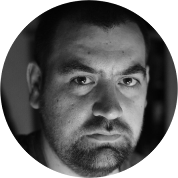

# Маров Артём

## Обо мне
Я много лет занимаюсь техническим обеспечением мероприятий. Работал как звукорежиссёр, видеоинженер и светооператор в театральных постановках и на концертах. Работал техническим директором в небольшом частном театре.

Изучаю язык программирования Python для того чтобы расширить свои навыки или сменить сферу деятельности.

  